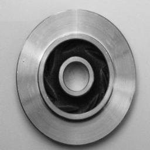
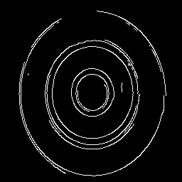
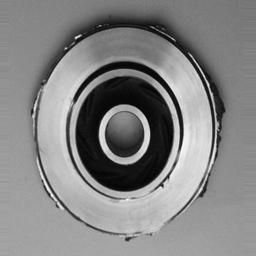
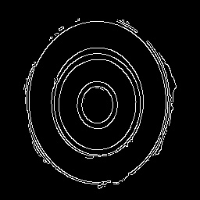

# Stable Diffusion Defect Synthesis

Controlled synthesis of industrial casting defects using Stable Diffusion, ControlNet, and LoRA through latent text-embedding arithmetic.

The project generates industrial casting parts from a Canny edge map and then steers the semantic result between a clean surface and a defect state using prompt interpolation.


## Gallery

The examples below come from `demo/assets` and show the exact pairing used by the demo and research notebooks.

| Clean part | Clean Canny | Defective part | Defective Canny |
| --- | --- | --- | --- |
|  |  |  |  |

Sample captions used in the demo assets:

- Clean part: `photo of SKS_PART, top-down industrial inspection, circular machined component, flat grey ferrous material, flawless smooth surface, QC passed, neutral factory lighting, plain background`
- Defective part: `photo of SKS_PART, top-down industrial inspection, circular machined component, flat grey ferrous material, severe porosity defect, surface blowholes and cavities, QC failed manufacturing reject, neutral factory lighting, plain background`

## What This Repository Does

- Trains a LoRA adapter on top of Stable Diffusion v1.5.
- Uses ControlNet Canny guidance to preserve geometry.
- Interpolates between clean and defective text embeddings to control defect severity.
- Provides a Gradio demo for quick inference.
- Keeps sample assets in `demo/assets` so Hugging Face Spaces has a ready-to-run example.

## Project Structure

```text
.
├── data/
│   ├── raw/
│   └── processed/
├── demo/
│   ├── assets/
│   ├── lora_weights/
│   └── app.py
├── research/
│   ├── train_sd.ipynb
│   └── inference_sd.ipynb
├── .gitattributes
├── .gitignore
├── environment.yml
├── requirements.txt
└── README.md
```

## Data Layout

The notebooks expect the following casting dataset layout:

```text
data/
├── raw/
│   └── casting/
│       └── casting_512x512/
│           ├── ok_front/
│           └── def_front/
└── processed/
    └── casting/
        └── casting_512x512/
            ├── ok_front/
            │   ├── images/
            │   └── canny/
            └── def_front/
                ├── images/
                └── canny/
```

The `.gitkeep` files preserve this structure even when the folders are empty.

## Dataset Reference

The casting images used to build this project are based on the Kaggle dataset below:

- https://www.kaggle.com/datasets/ravirajsinh45/real-life-industrial-dataset-of-casting-product

## Training Workflow

1. Prepare the raw casting images under `data/raw`.
2. Build the processed dataset with resized RGB images and matching Canny maps under `data/processed`.
3. Train the LoRA adapter in `research/train_sd.ipynb`.
4. Use `research/inference_sd.ipynb` to generate examples and explore latent arithmetic.
5. Copy the exported adapter weights into `demo/lora_weights` for the demo app.

## Demo

The Gradio app in `demo/app.py` loads:

- Stable Diffusion v1.5 as the base generator.
- ControlNet Canny as the structural guide.
- The LoRA adapter from `demo/lora_weights`.

To run the demo locally:

```bash
python demo/app.py
```

## Installation

Create the Conda environment from `environment.yml` or install the lightweight Hugging Face dependencies from `requirements.txt`.

```bash
conda env create -f environment.yml
conda activate sd_defect_synthesis
```

or

```bash
pip install -r requirements.txt
```

## Hugging Face Notes

- `demo/assets` contains the sample canny image and example outputs used to bootstrap the Space.
- `demo/lora_weights` is the folder where the trained adapter should be placed.
- `.gitattributes` tracks large model files with Git LFS.
- `.gitignore` keeps raw images, processed images, and notebook outputs out of the repository while preserving the folder structure.

## Expected Output

The goal is to generate casting surfaces that remain geometrically consistent with the Canny input while allowing the semantic defect intensity to move from clean to defective through alpha interpolation.

## License

See [LICENSE](LICENSE) for the project license.
